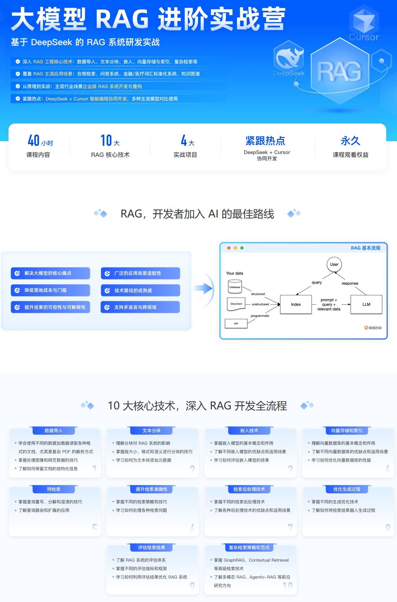
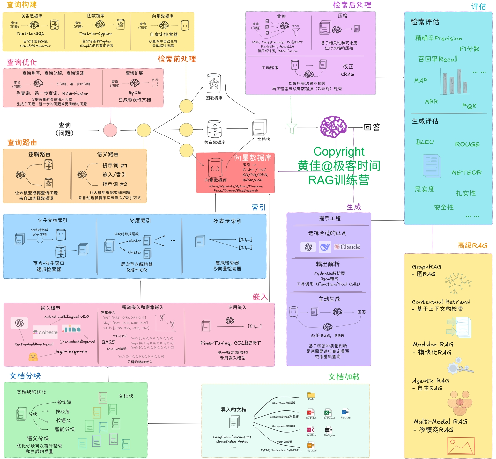

# RAG (Retrieval-Augmented Generation) 系统研发实战

本项目是一个基于 DeepSeek 的 RAG 系统[实战课程](https://u.geekbang.org/subject/airag/1009927)的代码仓库，实现了一个完整的检索增强生成系统。

课程地址：[RAG系统研发实战](https://u.geekbang.org/subject/airag/1009927)




## 技术框架




> 配套书籍[《RAG实战课》](https://item.jd.com/14447967.html)已经重磅出版！（人民邮电出版社）

[点击这里优惠购书](https://item.jd.com/14447967.html)

## 项目架构

项目采用模块化设计，每个模块负责 RAG 系统的不同方面：

| 模块 | 功能 | 技术栈 | 依赖 |
|------|------|--------|------|
| `00-简单RAG-SimpleRAG` | 基础 RAG 系统实现 | LangChain/LlamaIndex | 基础环境 |
| `01-数据导入-DataLoading` | 数据加载和预处理 | pandas, PyPDF2 | 文档解析库 |
| `02-文本切块-DocChunking` | 文档分块策略 | LangChain Splitters | NLP 工具 |
| `03-向量嵌入-Embedding` | 文本向量化 | HuggingFace, BGE | GPU 支持(可选) |
| `04-向量存储-VectorDB` | 向量数据库操作 | Milvus, Chroma | 向量数据库 |
| `05-检索前处理-PreRetrieval` | 检索优化 | Query Expansion | NLP 工具 |
| `06-索引优化-Indexing` | 索引构建和优化 | 层次索引, 关键词索引 | 搜索引擎 |
| `07-检索后处理-PostRetrieval` | 检索结果优化 | 重排序, 过滤 | ML 模型 |
| `08-响应生成-Generation` | 答案生成 | LLM 集成 | GPU 推荐 |
| `09-系统评估-Evaluation` | 系统性能评估 | RAGAS, TruLens | 评估框架 |
| `10-高级RAG-AdvanceRAG` | 高级 RAG 技术实现 | Graph RAG, Multi-Agent | 高级框架 |

## 环境要求

### 硬件要求

#### GPU 版本
- NVIDIA GPU (建议 >= 8GB 显存)
- CUDA 11.8 或更高版本
- cuDNN 8.0 或更高版本

#### CPU 版本
- 建议 >= 16GB RAM
- 多核处理器（建议 >= 4 核）

### 软件要求

#### 操作系统支持
1. **Ubuntu **
- 推荐使用 22.04 LTS

1. **MacOS (Intel/Apple Silicon)**
   - Apple Silicon 可以使用 MPS 加速

2. **Windows 10/11**
   - 推荐使用 WSL2 + Ubuntu

### 框架选择

1. Python：3.10+
2. LangChain 框架
   - 基础版：`requirements_langchain_简单RAG(后续模块还要安装其它包).txt`
   - 完整版（GPU）：`requirements_langchain_20250413(Ubuntu-with-GPU).txt`
   - 完整版（CPU）：`requirements_langchain_无GPU版(Mac,Win).txt`

3. LlamaIndex 框架
   - 基础版：`requirements_llamaindex_简单RAG(后续模块还要安装其它包).txt`
   - 完整版（GPU）：`requirements_llamaindex_20250413(Ubuntu-with-GPU).txt`
   - 完整版（CPU）：`requirements_llamaindex_无GPU版(Mac,Win).txt`

## 环境配置

### Ubuntu (GPU 版本+LangChain框架)

```bash
# 创建虚拟环境
python -m venv venv-rag-langchain
source venv-rag-langchain/bin/activate
## 或者使用conda
conda create -n venv-rag-langchain python=3.10.12
conda activate venv-rag-langchain

# 安装依赖
pip install -r 91-环境-Environment/requirements_langchain_20250413_Ubuntu-with-GPU.txt
```

### Ubuntu (CPU 版本+LangChain框架)

```bash
# 创建虚拟环境
python -m venv venv-rag-langchain
source venv-rag-langchain/bin/activate
## 或者使用conda
conda create -n venv-rag-langchain python=3.10.12
conda activate venv-rag-langchain

# 安装依赖
pip install -r 91-环境-Environment/requirements_langchain_Ubuntu-with-CPU.txt
```

### MacOS/Windows(CPU 版本+LangChain框架)
```bash
# 创建虚拟环境
python -m venv venv-rag-langchain
# Windows
.\venv-rag-langchain\Scripts\activate
# MacOS
source venv-rag-langchain/bin/activate
## 或者使用conda
conda create -n venv-rag-langchain python=3.10.12
conda activate venv-rag-langchain

# 安装依赖
pip install -r 91-环境-Environment/requirements_langchain_无GPU版_Mac-Win.txt
```

### Ubuntu (GPU 版本+LlamaIndex框架)

```bash
# 创建虚拟环境
python -m venv venv-rag-llamaindex
source venv-rag-llamaindex/bin/activate
## 或者使用conda
conda create -n venv-rag-llamaindex python=3.10.12
conda activate venv-rag-lanllamaindexgchain

# 安装依赖
pip install -r 91-环境-Environment/requirements_llamaindex_20250413_Ubuntu-with-GPU.txt
```

### Ubuntu (CPU 版本+LlamaIndex框架)

```bash
# 创建虚拟环境
python -m venv venv-rag-llamaindex
source venv-rag-llamaindex/bin/activate
## 或者使用conda
conda create -n venv-rag-llamaindex python=3.10.12
conda activate venv-rag-llamaindex

# 安装依赖
pip install -r 91-环境-Environment/requirements_llamaindex_Ubuntu-with-CPU.txt
```

### MacOS/Windows(CPU 版本+LlamaIndex框架)
```bash
# 创建虚拟环境
python -m venv venv-rag-llamaindex
# Windows
.\venv-rag-llamaindex\Scripts\activate
# MacOS
source venv-rag-llamaindex/bin/activate
## 或者使用conda
conda create -n venv-rag-llamaindex python=3.10.12
conda activate venv-rag-llamaindex

# 安装依赖
pip install -r 91-环境-Environment/requirements_llamaindex_无GPU版_Mac-Win.txt
```

## 特殊依赖说明

1. PDF 处理相关：
   - 使用 `requirements_camelot_20250413.txt` 安装 PDF 处理相关依赖
   - 可能需要额外安装系统级依赖：
     - Ubuntu: `sudo apt-get install ghostscript python3-tk`
     - MacOS: `brew install ghostscript tcl-tk`
     - Windows: 需要手动安装 Ghostscript

2. 标注工具相关：
   - 使用 `requirements_marker_20250413.txt` 安装标注工具相关依赖

## 使用说明

1. 选择合适的环境配置文件并安装依赖
2. 按照模块顺序逐步学习和实践
3. 每个模块都包含独立的示例和说明文档
4. 建议先从 `00-简单RAG-SimpleRAG` 开始，逐步深入

## 注意事项

1. GPU 版本需要确保 CUDA 环境配置正确
2. 不同操作系统可能需要额外的系统级依赖
3. 建议使用虚拟环境管理依赖
4. 部分模块可能需要额外的模型下载或 API 密钥配置

## 常见问题

1. CUDA 相关错误：检查 NVIDIA 驱动和 CUDA 版本是否匹配
2. 内存不足：调整批处理大小或使用 CPU 版本
3. 依赖冲突：使用虚拟环境并严格按照 requirements 文件安装

## 贡献指南

欢迎提交 Issue 和 Pull Request 来帮助改进项目。

[](https://www.star-history.com/#huangjia2019/langchain-in-action&huangjia2019/ai-agents&huangjia2019/let-us-machine-learning&huangjia2019/rag-in-action&huangjia2019/llm-gpt&Date)

## 许可证

本项目采用 MIT 许可证。